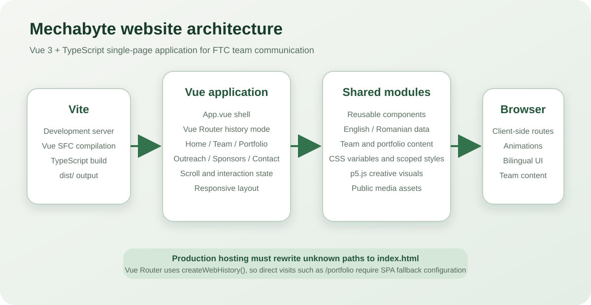
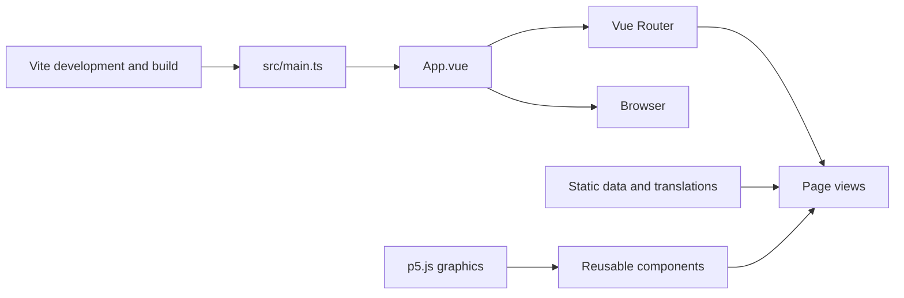
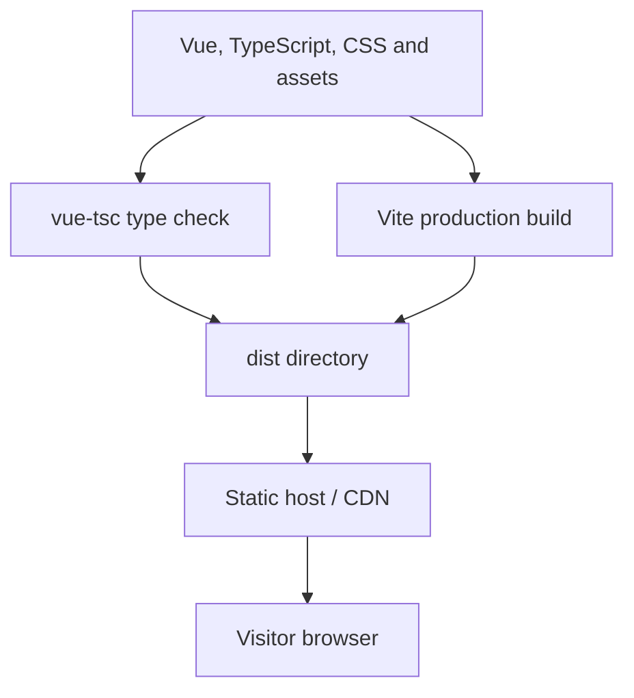

# Mechabyte Website

**Official bilingual website for Mechabyte #22590, a FIRST Tech Challenge robotics team from Paradise International College in Iași, Romania.**

<p align="center">
  
</p>

<p align="center">
  
</p>

<p align="center">
  
  
  
  
  
  
</p>

## Project purpose

The Mechabyte website is a public communication platform for the team. It presents:

- the team’s identity and current season;
- members and roles;
- robots, mechanisms and achievements;
- community outreach;
- sponsors and institutional supporters;
- contact information;
- interactive visual elements that reinforce the team’s engineering identity.

The application is a Vue 3 single-page application built with TypeScript and Vite. It contains no server-side application or database. Content is currently stored in source files and static assets.

## Main features

- English and Romanian interface content.
- Responsive multi-page experience implemented through Vue Router.
- Vue 3 Composition API and single-file components.
- Reusable navigation and visual components.
- Team, portfolio, outreach, sponsor and contact views.
- p5.js-powered creative graphics.
- Scroll-triggered reveal behaviour.
- Scoped component styling and shared CSS variables.
- Reduced-motion considerations.
- TypeScript checking as part of the production build.
- Static production output suitable for CDN hosting.

## Application routes

| Route | View | Purpose |
|---|---|---|
| `/` | `Home.vue` | Team introduction and landing experience |
| `/team` | `Team.vue` | Team members and roles |
| `/portfolio` | `Portfolio.vue` | Robots, mechanisms, achievements and project history |
| `/outreach` | `Outreach.vue` | Community and educational activities |
| `/sponsors` | `Sponsors.vue` | Sponsors and supporters |
| `/contact` | `Contact.vue` | Contact and collaboration information |

The router uses `createWebHistory()`. Production hosting must rewrite unknown browser paths to `index.html`; otherwise a direct request to `/portfolio` or another client-side route may return 404.

## Architecture



### Build flow



## Technology stack

| Layer | Technology | Role |
|---|---|---|
| UI framework | Vue 3 | Reactive components and page composition |
| Language | TypeScript | Static checking and maintainable component logic |
| Build tool | Vite 5 | Development server, bundling and optimisation |
| Routing | Vue Router 4 | Client-side navigation using browser-history URLs |
| Creative graphics | p5.js 2 | Interactive and decorative canvas elements |
| Styling | CSS and scoped Vue styles | Responsive layout, branding and animations |
| Type checking | `vue-tsc` | Validate Vue templates and TypeScript together |
| Script orchestration | `npm-run-all2` | Run type checking and production build tasks |

## Requirements

- Node.js 18 or newer.
- npm compatible with the selected Node.js release.
- Git.

Verify:

```bash
node --version
npm --version
git --version
```

## Local setup

### 1. Clone

```bash
git clone https://github.com/paradis-college/Mechabyte.git
cd Mechabyte
```

### 2. Install dependencies

For a normal local setup:

```bash
npm install
```

For reproducible CI or when `package-lock.json` is present and current:

```bash
npm ci
```

### 3. Start the development server

```bash
npm run dev
```

Vite prints the local address, normally:

```text
http://localhost:5173
```

### 4. Open the site

Use the displayed address and navigate through every route. Vite provides hot-module replacement while editing Vue components and styles.

## Available scripts

| Command | Purpose |
|---|---|
| `npm run dev` | Start the Vite development server |
| `npm run type-check` | Run `vue-tsc` across the project |
| `npm run build-only` | Build without first running type checks |
| `npm run build` | Run type checking and create a production bundle |
| `npm run preview` | Serve the generated production build locally |

## Production build

```bash
npm run build
```

The script runs:

1. `vue-tsc --build --force`;
2. `vite build`.

Output is written to:

```text
dist/
```

Preview the exact production bundle:

```bash
npm run preview
```

A successful development server is not sufficient validation; run the production build before opening a pull request.

## Deployment

Any host capable of serving static files and applying a single-page-app fallback can deploy the project.

### Netlify

Suggested settings:

```text
Build command: npm run build
Publish directory: dist
```

Add a redirect file under `public/_redirects`:

```text
/* /index.html 200
```

### Vercel

Suggested settings:

```text
Framework preset: Vite
Build command: npm run build
Output directory: dist
```

Add a rewrite configuration when direct history-mode routes are not automatically handled.

### GitHub Pages

GitHub Pages requires additional configuration because:

- the application uses history-mode routes;
- project-site deployments may live under `/repository-name/` rather than `/`;
- `vite.config.ts` currently does not set a non-root `base`.

For a project-site deployment, set the Vite base and choose either a route fallback strategy or hash routing. Test asset URLs and direct route refreshes before publishing.

### Generic static server

Serve `dist/` and rewrite every non-file request to `dist/index.html`.

Example Nginx rule:

```nginx
location / {
  try_files $uri $uri/ /index.html;
}
```

## Repository structure

```text
Mechabyte/
├── public/
│   ├── banner.png
│   └── other unprocessed static assets
├── src/
│   ├── assets/
│   │   ├── images/
│   │   └── styles/
│   ├── components/
│   │   ├── NavBar.vue
│   │   ├── GearConveyor.vue
│   │   ├── HeroRobotArm.vue
│   │   ├── MicroButton.vue
│   │   └── ...
│   ├── composables/
│   │   └── useRevealOnScroll.ts
│   ├── data/
│   ├── hooks/
│   ├── i18n/
│   │   └── translations.ts
│   ├── router/
│   │   └── index.ts
│   ├── views/
│   │   ├── Home.vue
│   │   ├── Team.vue
│   │   ├── Portfolio.vue
│   │   ├── Outreach.vue
│   │   ├── Sponsors.vue
│   │   └── Contact.vue
│   ├── App.vue
│   └── main.ts
├── docs/
│   └── application-architecture.svg
├── COMPONENTS.md
├── MANUAL_QA_GUIDE.md
├── index.html
├── package.json
├── package-lock.json
├── vite.config.ts
├── tsconfig.json
└── README.md
```

## Internationalisation

English and Romanian translations are managed in:

```text
src/i18n/translations.ts
```

When adding user-visible content:

1. add the key to the translation type/interface;
2. add an English value;
3. add a Romanian value;
4. use the translation value in the relevant component;
5. test both languages on every affected route;
6. verify longer Romanian text does not break the layout.

Avoid hard-coding visible copy in a component unless it is deliberately language-independent.

## Components

Reusable UI belongs under `src/components/`. Existing components include navigation, buttons, animated mechanical elements and hero graphics.

A component should generally:

- have a focused responsibility;
- declare typed props;
- emit documented events;
- avoid duplicating page content;
- use scoped styles when styles are component-specific;
- honour reduced-motion preferences;
- include accessible labels for non-text controls.

More detailed component notes are available in `COMPONENTS.md`.

## Styling conventions

- Use shared CSS custom properties for brand colours and spacing.
- Keep component-specific rules inside `<style scoped>` where practical.
- Preserve the existing mechanical/robotics visual identity.
- Test the project’s `1000px` mobile transition and smaller phone widths.
- Avoid relying exclusively on viewport units for text that must remain legible.
- Test content at 200% browser zoom.
- Keep animation transforms independent from layout-critical positioning.

Common variables include:

```css
--background-grey
--mechabyte-green
```

## Content editing

### Add a team member

1. Find the team data source or the member list in `Team.vue`.
2. Add the member’s approved name, role and media.
3. Add translation keys for visible role descriptions.
4. Optimise the image before committing it.
5. Confirm responsive card layout and alternative text.

### Add a portfolio item

1. Add the structured content or Vue markup used by `Portfolio.vue`.
2. Include date/season context.
3. Explain what was built and what the team contributed.
4. Distinguish awards, nominations and participation accurately.
5. Add media with descriptive captions.
6. Test both languages.

### Add a sponsor

1. Use an approved logo asset.
2. Confirm permission to display it.
3. Include an accessible organisation name.
4. Do not embed third-party tracking without explicit review.
5. Verify the logo remains legible in light and dark contexts.

## Quality checks

Run:

```bash
npm run type-check
npm run build
npm run preview
```

Then verify:

```text
[ ] Home loads without console errors
[ ] All six routes navigate correctly
[ ] Refreshing a nested route works on the target host
[ ] English and Romanian content are complete
[ ] Navigation is usable with keyboard only
[ ] Focus indicators are visible
[ ] Images have useful alt text
[ ] Mobile layout works below 1000px
[ ] Reduced-motion preference is respected
[ ] Contact links use correct destinations
[ ] Production build contains no accidental private files
```

The repository also contains `MANUAL_QA_GUIDE.md` for broader manual checks.

## Troubleshooting

### TypeScript or Vue template errors

```bash
npm run type-check
```

Read the first reported error before fixing downstream failures.

### Port already in use

```bash
npm run dev -- --port 3000
```

### Dependency installation is inconsistent

Prefer a clean lockfile-based installation:

```bash
rm -rf node_modules
npm ci
```

On Windows PowerShell:

```powershell
Remove-Item node_modules -Recurse -Force
npm ci
```

Avoid deleting `package-lock.json` as a routine fix because it weakens reproducibility.

### Direct route works locally but returns 404 after deployment

Configure the host to rewrite unknown paths to `index.html`. This is required because the router uses browser-history mode.

### Assets fail on a subpath deployment

Review Vite’s `base` configuration. Root-relative assumptions can fail when the site is hosted under a repository path.

### p5.js visual is not mounting

Check:

- the component lifecycle hook;
- whether the container exists before creating the sketch;
- cleanup when the component unmounts;
- canvas sizing after responsive layout changes.

## Contribution workflow

```bash
git checkout main
git pull
git checkout -b feat/descriptive-change
npm ci
npm run dev
```

Before committing:

```bash
npm run type-check
npm run build
```

Commit with a focused message:

```bash
git add .
git commit -m "feat: add outreach event timeline"
```

Then push and open a pull request:

```bash
git push -u origin feat/descriptive-change
```

Use one logical change per pull request. Include screenshots for visible changes and test both supported languages.

## Security and privacy

This is a public youth-team website. Review content carefully before publication:

- do not publish private contact information for students;
- obtain permission for names, photographs and biographies;
- avoid exposing schedules that create unnecessary safety risks;
- keep contact flows directed through approved adult/team channels;
- remove image metadata when appropriate;
- review third-party embeds and analytics before adding them;
- do not commit secrets or service tokens to frontend source.

Every value shipped in the Vue application can be inspected by visitors.

## Known limitations

- Content is source-controlled rather than managed through a CMS.
- The router requires host-specific SPA fallback configuration.
- There is no automated unit or end-to-end test suite declared in `package.json`.
- Visual regression testing is manual.
- Dependency versions use compatible ranges rather than exact pins in `package.json`; the lockfile is therefore important.
- Some team facts and sponsor information may become stale without a review schedule.
- The project has no documented production URL or deployment workflow in the repository.
- There is no explicit open-source licence file.
- Privacy approval and media consent are operational processes rather than automated checks.

## Recommended next steps

1. Add ESLint and Prettier with project-owned configuration.
2. Add component tests with Vitest and Vue Test Utils.
3. Add browser tests for routes and language switching with Playwright.
4. Add a CI workflow that runs type checking and production builds.
5. Add deployment configuration and document the canonical live URL.
6. Add automated accessibility checks.
7. Add a content-review date for team members, achievements and sponsors.
8. Add image optimisation and size budgets.
9. Add route metadata for page titles and social previews.
10. Add an explicit licence or a clear all-rights-reserved policy.

## Additional documentation

- [`COMPONENTS.md`](./COMPONENTS.md) — component catalogue and implementation notes.
- [`MANUAL_QA_GUIDE.md`](./MANUAL_QA_GUIDE.md) — manual browser and content validation.
- [`.github/copilot-instructions.md`](./.github/copilot-instructions.md) — repository-specific agent guidance.

## Project ownership

- Team: Mechabyte #22590.
- Institution: Paradise International College, Iași, Romania.
- Competition: FIRST Tech Challenge.

## Licence

No explicit licence file is currently included. The repository is maintained by the team and institution; absent a licence, the code and media remain under their default copyright rights.
